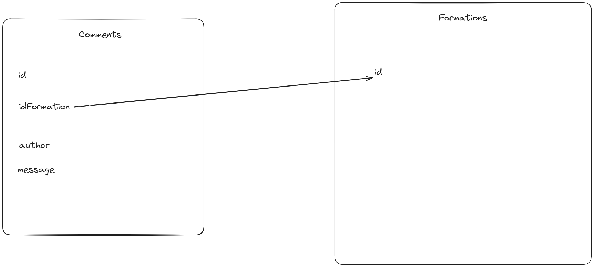

Création entity Comments

champs :

- idFormation : relation -> Formation -> ManyToOne -> no (non null) -> yes (add a new property) -> rating -> no (delete orphaned)

- author : string -> Varchar 255 -> no (non null)

- message : string -> Varchar 255 -> no (non null)

MIGRATE ET MIGRATION

## Twig (formation)

```html
<div class="row mt-3">
  <div class="col">
    <h5>Ajouter un commentaire</h5>
    <form method="POST" action="{{ path('formations.comment.add') }}">
      <div class="form-group">
        <label for="author">Votre nom : </label>
        <textarea
          class="form-control"
          id="author"
          name="author"
          rows="1"
        ></textarea>
        <br />
        <textarea
          class="form-control"
          id="comment"
          name="comment"
          rows="3"
        ></textarea>
        <input type="hidden" name="formationId" value="{{ formation.id }}" />
        <button type="submit" class="btn btn-primary">Ajouter</button>
      </div>
    </form>
  </div>
</div>
<hr />
    {{
totalComments }} commentaires  {{ totalComments }} commentaire 
<h5>Liste des commentaires ({{ totalComments }}):</h5>
<hr />
 Auteur : <b>{{ comments.author }}</b>
<br />
<br />
Message : <b>{{ comments.message }}</b>
<br />
<hr />
<br />
  
```

## Controlleur (formations):

```php
/**
     * @Route("/formations/comment/add", name="formations.comment.add")
     * @param Request $request
     * @return Response
     */
    public function ajoutCommentaire(Request $request, ManagerRegistry $doctrine): Response{
        $author = $request->get("author");
        $message = $request->get("comment");
        $formationId = $request->get("formationId");

        $formation = $doctrine->getRepository(Formation::class)->find($formationId);

        $comment = new Comments();
        $comment->setAuthor($author);
        $comment->setMessage($message);
        $comment->setIdFormations($formation);
        $this->commentsRepository->add($comment, true);
        return $this->redirectToRoute('formations');
    }
```
