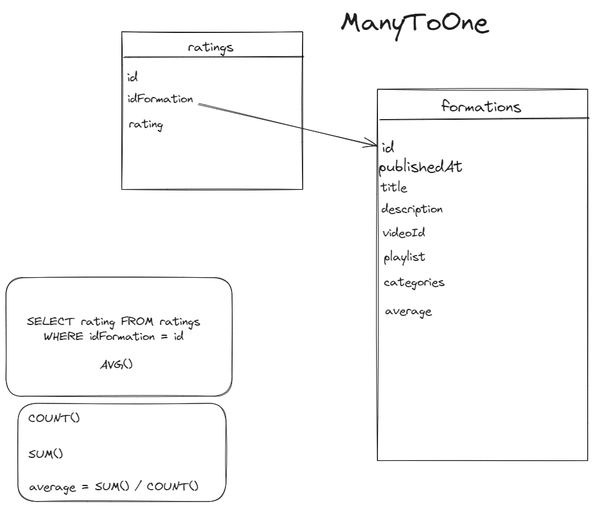

Création entity Ratings

champs :

- idFormation : relation -> Formation -> ManyToOne -> no (non null) -> yes (add a new property) -> rating -> no (delete orphaned)

- rating : integer -> no (non null)

MIGRATE ET MIGRATION

<br>

Modification entity Formation

- Nouveau champ : average -> float -> no (non null)

<br>

Vue twig Formations :

```html
<td class="text-center">
  
  <span class="badge bg-secondary">aucune note</span>
  
  <span class="badge bg-info">{{ formation.average }}</span>
  
</td>
```

<br>

TRIGGER :

```sql
DELIMITER //

CREATE TRIGGER update_average_rating
AFTER INSERT ON ratings
FOR EACH ROW
BEGIN
    DECLARE new_average DECIMAL(10,2);

    -- Calculate the new average rating for the formation
    SELECT AVG(rating) INTO new_average
    FROM ratings
    WHERE id_formation_id = NEW.id_formation_id;

    -- Update the average rating in the formation table
    UPDATE formation
    SET average = new_average
    WHERE id = NEW.id_formation_id;
END;
//

DELIMITER ;
```
